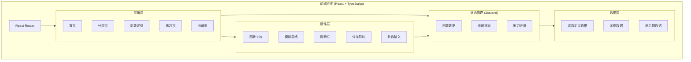
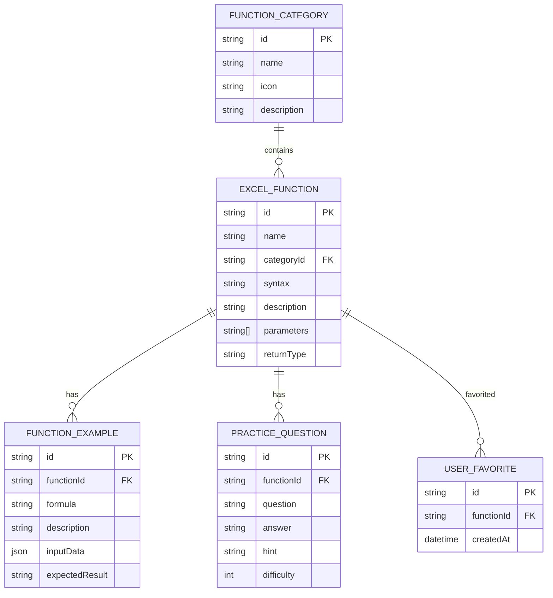

# Excel函数学习助手 - 项目设计文档

## 系统架构

## 数据模型

## 页面路由

| 路由 | 页面 | 说明 |
|------|------|------|
| `/` | 首页 | 函数分类概览、搜索入口 |
| `/category/:id` | 分类页 | 某分类下的所有函数列表 |
| `/function/:id` | 详情页 | 函数详细说明、交互演示 |
| `/practice` | 练习页 | 练习题列表和答题 |
| `/favorites` | 收藏页 | 用户收藏的函数 |

## UI/UX 规范

### 色彩系统

| 用途 | 颜色值 | 说明 |
|------|--------|------|
| 主色 | `#217346` | Excel绿，品牌色 |
| 主色浅 | `#2E8B57` | 悬停状态 |
| 主色深 | `#1D5C38` | 按下状态 |
| 背景色 | `#F5F7FA` | 页面背景 |
| 卡片背景 | `#FFFFFF` | 卡片背景 |
| 文字主色 | `#1F2937` | 主要文字 |
| 文字次色 | `#6B7280` | 次要文字 |
| 边框色 | `#E5E7EB` | 边框、分割线 |
| 成功色 | `#10B981` | 成功提示 |
| 错误色 | `#EF4444` | 错误提示 |
| 警告色 | `#F59E0B` | 警告提示 |

### 字体规范

| 用途 | 字号 | 字重 |
|------|------|------|
| 页面标题 | 24px | 700 |
| 卡片标题 | 18px | 600 |
| 正文 | 14px | 400 |
| 辅助文字 | 12px | 400 |
| 代码/公式 | 14px | 500 (monospace) |

### 间距规范

- 基础单位：4px
- 常用间距：8px, 12px, 16px, 24px, 32px
- 卡片内边距：16px
- 卡片间距：16px
- 页面边距：24px

### 圆角规范

| 元素 | 圆角 |
|------|------|
| 按钮 | 8px |
| 卡片 | 12px |
| 输入框 | 8px |
| 标签 | 4px |
| 模态框 | 16px |

### 阴影规范

| 层级 | 阴影值 |
|------|--------|
| 卡片 | `0 2px 8px rgba(0,0,0,0.08)` |
| 悬停 | `0 4px 16px rgba(0,0,0,0.12)` |
| 弹窗 | `0 8px 32px rgba(0,0,0,0.16)` |

## 函数分类

1. **文本函数** - CONCAT, LEFT, RIGHT, MID, LEN, TRIM, UPPER, LOWER, SUBSTITUTE
2. **数学函数** - SUM, AVERAGE, MAX, MIN, COUNT, ROUND, ABS, MOD, POWER
3. **日期函数** - TODAY, NOW, DATE, YEAR, MONTH, DAY, DATEDIF, WEEKDAY
4. **逻辑函数** - IF, AND, OR, NOT, IFERROR, IFS, SWITCH
5. **查找函数** - VLOOKUP, HLOOKUP, INDEX, MATCH, XLOOKUP
